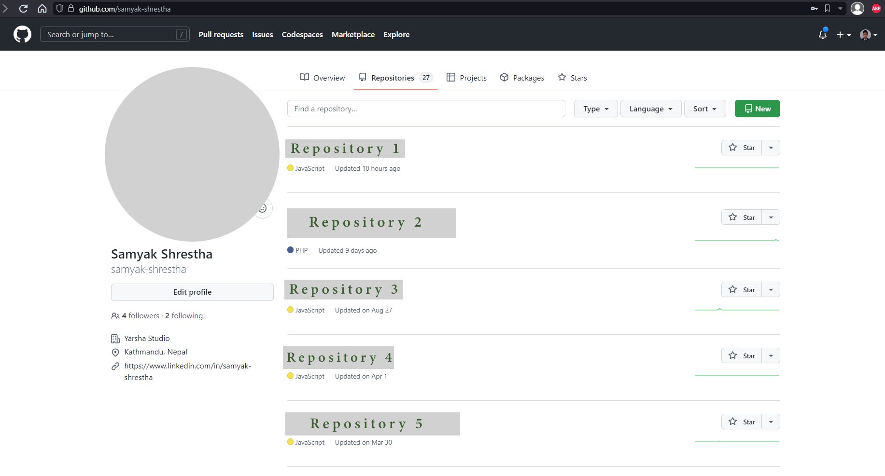
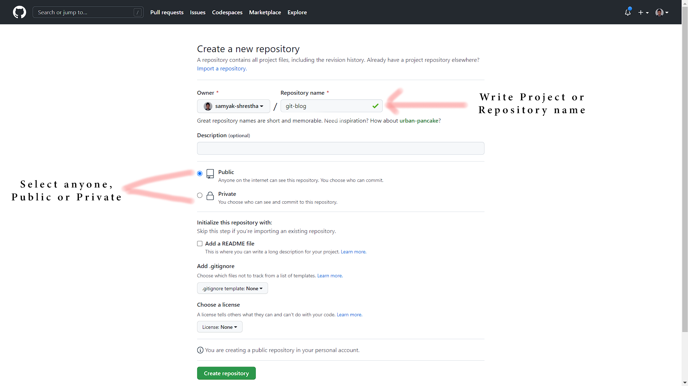
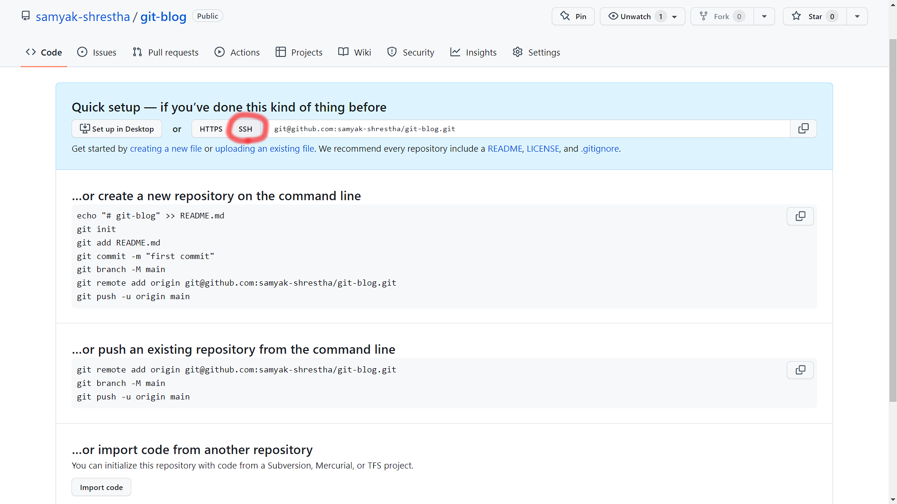

1. After login, go to profile page, you will see **"New"** Button on top right. Click on **New** to create a new repository.

2. then Provide Project or Repository Name. Select Private or Public, according to your project preference. then save changes to create a repo.

3. you will be redirected to your repo, now by default some commands will be provided.

    - now you can follow commands give on the repo.